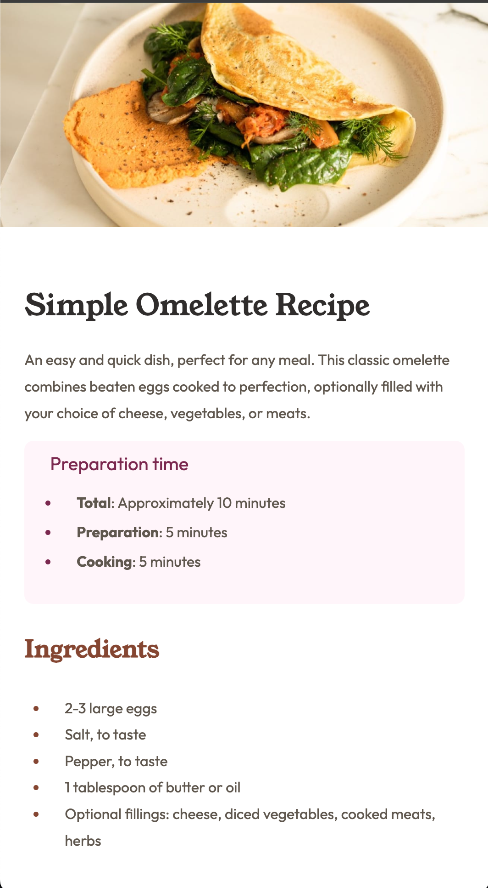

# Frontend Mentor - Recipe page solution

This is a solution to the [Recipe page challenge on Frontend Mentor](https://www.frontendmentor.io/challenges/recipe-page-KiTsR8QQKm). Frontend Mentor challenges help you improve your coding skills by building realistic projects. 

## Table of contents

- [Overview](#overview)
  - [The challenge](#the-challenge)
  - [Screenshot](#screenshot)
  - [Links](#links)
- [My process](#my-process)
  - [Built with](#built-with)
  - [What I learned](#what-i-learned)

## Overview

This is my solution to the front end mentor recipe page challenge

### Screenshot

### Links

- Solution URL: [https://github.com/ash-kick/recipe-page]()
- Live Site URL: [https://ash-kick.github.io/recipe-page/]()

## My process

I started with building out the HTML then moved on to adding the global CSS rules on a separate style sheet. Once I completed those I added specific CSS styles based on the page size.

### Built with

- Semantic HTML5 markup
- CSS custom properties
- Flexbox
- Mobile-first workflow

### What I learned

I learned about padding application and having adaptable styles.

To see how you can add code snippets, see below:
